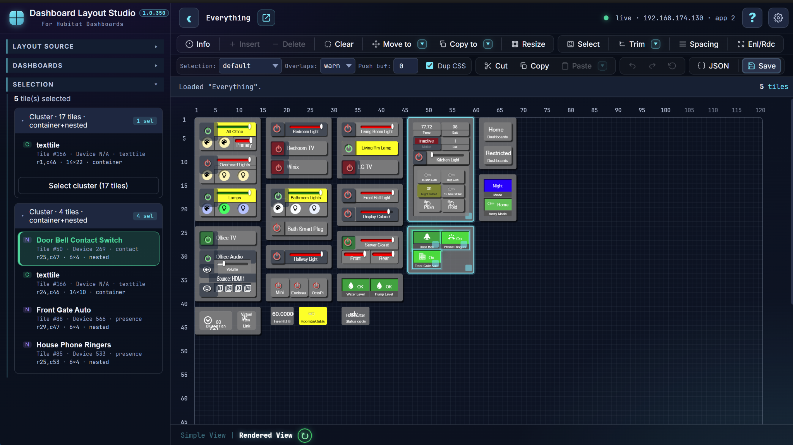

# Dashboard Layout Studio



**Dashboard Layout Studio** is a visual layout editor for **Hubitat Dashboard v1** layouts.

It is designed for Hubitat users who have outgrown the built-in dashboard editor and need a faster, safer way to reorganize dashboards, duplicate styled tiles, copy tiles between dashboards, preserve tile-specific CSS, clean up CSS, manage device assignments, and work in a separate editing workspace before saving changes back to the hub.

> **Dashboard Layout Studio is for Hubitat Dashboard v1 layouts. It is not for EZ Dashboards.**

---

## Why Use Dashboard Layout Studio?

The built-in Hubitat dashboard editor is useful for small edits, but larger layout changes can become tedious:

- Tiles have to be adjusted one at a time.
- There is no practical group selection workflow.
- There is no drag-and-drop workspace for moving groups of tiles.
- There is no easy way to duplicate a styled tile.
- Custom CSS has to be copied, retargeted, and maintained by hand.
- There is no CSS cleanup or conflict checking.
- There is no easy way to merge tiles from another dashboard.
- There are no bulk spacing, resizing, or layout cleanup tools.
- Edits in the hub are live, with no separate workspace or undo stack.

Dashboard Layout Studio provides a separate visual workspace where you can load a dashboard, edit it, experiment, undo changes, validate device assignments, clean up CSS, and then save the finished layout back to the hub.

---

## Current Version

**Version:** `1.0.353`

Dashboard Layout Studio is distributed as a single HTML file.

Back up dashboards before using any tool that can modify dashboard JSON.

---

## Online Mode and Offline Mode

Dashboard Layout Studio can be used in two layout modes. The mode is determined by how the layout was loaded.

### Online Mode

Online Mode means the layout was loaded directly from the Hubitat hub.

Online Mode requires the Dashboard Layout Studio HTML file to be hosted from the Hubitat hub, normally from the hub's `/local/` file storage.

Online Mode does **not** use the Hubitat cloud. Hub communication is local network communication with your hub.

Online Mode can:

- Load layouts directly from the hub
- Save layouts directly back to the hub
- Capture rendered snapshots of actual dashboard tiles
- Show hub device names
- Check tile device assignments against the dashboard's selected devices
- Add missing devices to the dashboard's selected device list
- Remove unused devices from the dashboard's selected device list
- Use all Offline Mode editing capabilities

### Offline Mode

Offline Mode means the layout was loaded from a file or from pasted JSON.

Offline Mode can:

- Load layouts from files
- Save layouts to files
- Load layout JSON from the clipboard
- Copy layout JSON to the clipboard
- Edit layouts using placeholder tiles
- Use the main layout, spacing, resize, undo, JSON, and CSS tools

Offline layouts do not have a hub save target. Connecting to the hub from an offline layout closes the offline workspace and clears the grid and undo history after warning about unsaved changes.

---

## Feature Availability

| Feature | Online Mode | Offline Mode |
|---|---:|---:|
| Load layout from hub | Yes | No |
| Save layout to hub | Yes | No |
| Load from file or clipboard | Yes | Yes |
| Save to file or clipboard | Yes | Yes |
| Placeholder Simple View | Yes | Yes |
| Rendered View snapshots | Yes | No |
| Hub device names | Yes | No |
| Dashboard selected-device checks | Yes | No |
| Invalid hub-device detection | Yes | No |
| Add missing selected devices to hub dashboard | Yes | No |
| Remove unused selected devices from hub dashboard | Yes | No |
| Visual tile editing | Yes | Yes |
| Copy/paste tiles | Yes | Yes |
| Copy tile-scoped CSS | Yes | Yes |
| JSON editor | Yes | Yes |
| CSS cleanup | Yes | Yes |
| Undo/redo workspace | Yes | Yes |

---

## Simple View and Rendered View

Dashboard Layout Studio includes two layout views.

### Simple View

Simple View uses placeholder tiles. It is fast and useful for general layout editing.

### Rendered View

Rendered View captures snapshots of the actual Hubitat dashboard tiles and uses those snapshots inside the editor.

Rendered View helps when working with dashboards where the real appearance matters, including dashboards with:

- Custom CSS
- Custom icons
- Tile colors
- Hidden labels
- Overlapping tiles
- Compact layouts
- Customized tile spacing

Rendered View requires Online Mode and a dashboard loaded directly from the hub.

---

## Visual Tile Selection

Tiles can be selected in several ways:

- Click a tile
- Ctrl/Cmd-click to add or remove a tile from the current selection
- Alt-click a connected tile cluster
- Double-click a tile or cell to select a connected cluster
- Drag a rectangular selection range
- Select one or more rows
- Select one or more columns
- Shift-click row or column headers to extend a line selection

Once selected, tiles can be moved, copied, resized, cleared, deleted, spaced, or adjusted as a group.

---

## Move, Copy, Paste, and Duplicate Tiles

Dashboard Layout Studio supports layout operations that are difficult or unavailable in the standard Hubitat dashboard editor:

- Move groups of tiles
- Drag selected tiles to new locations
- Copy tiles within the same dashboard
- Copy tiles between dashboards
- Paste tiles into another dashboard layout
- Clear tiles while leaving empty space
- Insert rows or columns
- Delete rows or columns
- Push tiles right or down
- Pull tiles left or up
- Choose how conflicts with existing tiles should be handled

When tiles are copied, the tool assigns new tile IDs that do not conflict with existing tiles or tile-scoped CSS rules.

---

## Copy Tiles with Their CSS

For dashboards that use custom CSS, Dashboard Layout Studio can duplicate tile-scoped CSS when tiles are copied.

For example, CSS rules targeting a copied tile can be replicated and retargeted to the new tile ID.

This allows styled tiles to be duplicated without manually finding and editing every `#tile-123` rule.

---

## Merge Tiles from Other Dashboards

Dashboard Layout Studio can help reuse sections of one dashboard inside another.

When copying or importing tiles from another dashboard, it can:

- Assign safe new tile IDs
- Preserve related tile-scoped CSS
- Retarget copied CSS to the new tile IDs
- Check assigned devices against the destination dashboard
- Warn when copied tiles use devices that are not selected for the destination dashboard

---

## Tile Spacing and Layout Cleanup

Dashboard Layout Studio includes tools for cleaning up and reorganizing dashboard layouts:

- Set uniform spacing between tiles or groups
- Increase existing spacing
- Decrease existing spacing
- Preserve clusters and nested groups
- Unstack overlapping tiles and spread them out
- Enlarge or reduce tiles while preserving layout and spacing
- Resize selected tiles to a uniform size
- Resize tiles by dragging tile corners
- Resize container-style tile groups while preserving their internal layout
- Trim unused rows and columns

These tools are useful when a dashboard has grown over time and needs to be aligned, enlarged, spaced out, or reorganized.

---

## Workspace Editing with Undo/Redo

Dashboard Layout Studio provides a workspace separate from the live Hubitat dashboard.

You can:

- Make layout changes without immediately changing the hub dashboard
- Undo and redo individual steps
- Undo all changes back to the loaded layout
- Review changes before saving back to the hub

The hub dashboard is not changed until the updated layout is explicitly saved.

---

## Device Management

Dashboard Layout Studio includes device-management tools for layouts.

It can:

- Show the device assigned to each tile
- Show device names from the hub
- Identify blank, invalid, unknown, or unselected device IDs
- Highlight invalid device assignments
- Highlight valid devices assigned to tiles but not selected for the dashboard
- Reassign tile devices
- Add devices to the dashboard's selected device list
- Remove unused devices from the dashboard's selected device list
- Warn before saving if tile devices are not selected for the dashboard

This is especially useful when copying tiles between dashboards, importing JSON, or cleaning up older dashboards.

---

## CSS Tools

Dashboard Layout Studio includes CSS tools for dashboards that use custom styling.

It can:

- View tile-specific CSS
- Edit CSS rules associated with a tile
- Replicate tile-scoped CSS when duplicating tiles
- Remove tile-scoped CSS when tiles are removed
- Detect duplicate CSS
- Detect conflicting CSS
- Find orphaned tile CSS
- Consolidate repeated selector rules
- Optionally preserve removed or changed CSS as comments

The CSS Cleanup tool checks for:

- **Conflicts** — the same selector and property has different values
- **Duplicates** — repeated declarations with the same value
- **Consolidation** — repeated selector rules that can be combined
- **Orphans** — tile-scoped rules that reference tile IDs no longer present in the layout

For dashboards with a lot of hand-written CSS, this can save substantial cleanup time.

---

## JSON Editor

Dashboard Layout Studio includes a JSON Editor for users who want direct access to the dashboard JSON.

It supports:

- Backing up layouts
- Importing layouts
- Full JSON editing
- Viewing and editing `customHTML` separately
- Viewing and editing `customJS` separately
- Viewing and editing `customCSS` separately
- Formatting and validating JSON
- Basic validation and formatting for `customHTML` and `customJS`
- Enhanced validation and formatting for `customCSS`
- Tile Devices review
- Dashboard Devices review

The visual editor and JSON editor are designed to work together.

---

## Status Indicators

Dashboard Layout Studio includes top-level status indicators for common layout problems:

- CSS issue indicator
- Device issue indicator

The device indicator can show:

- **Red** when tiles reference device IDs that do not exist on the hub
- **Yellow** when tiles reference valid hub devices that are not selected for the dashboard

Clicking these indicators opens the relevant JSON Editor tab for review.

---

## Hub Save Safety Checks

Before saving back to the hub, Dashboard Layout Studio performs checks to reduce the chance of accidental damage:

- Verifies that the hub dashboard layout has not changed since it was loaded
- Warns before overwriting hub-side changes
- Warns when replacing a hub-loaded layout through the JSON editor
- Validates tile device assignments against the dashboard's selected devices
- Warns about device assignments that may be lost
- Shows progress during hub communication

Backups are still recommended before making major changes.

---

## Installation

Dashboard Layout Studio is distributed as a single HTML file.

### Online Mode Installation

1. Download the latest `dashboard-layout-studio-v###.html` file.
2. Upload it to the Hubitat hub's file storage so it is available under `/local/`.
3. Open the file from the hub in a browser.

Example URL format:

```text
http://<hub-ip>/local/dashboard-layout-studio-v###.html
```

Replace `<hub-ip>` with the hub's IP address and `v###` with the build number.

### Offline Use

1. Download the latest HTML file.
2. Open it directly in a browser.
3. Load dashboard JSON from a file or the clipboard.
4. Save edited layouts back to a file or clipboard.

Offline Mode does not provide direct hub load/save, rendered snapshots, or hub device validation.

---

## Basic Workflow

### Online Workflow

1. Open Dashboard Layout Studio from the hub.
2. Connect to the hub if needed.
3. Load a dashboard from the dashboard list.
4. Make layout changes in the visual editor.
5. Review device and CSS indicators.
6. Use the JSON Editor or CSS tools if needed.
7. Save the finished layout back to the hub.

### Offline Workflow

1. Open Dashboard Layout Studio locally.
2. Load dashboard JSON from a file or clipboard.
3. Edit the layout using placeholder tiles.
4. Use JSON/CSS tools if needed.
5. Save the edited layout back to a file or clipboard.

---

## Requirements and Limitations

- Dashboard Layout Studio is for **Hubitat Dashboard v1** only.
- It is **not for EZ Dashboards**.
- Rendered View requires the file to be hosted from the Hubitat hub.
- Direct hub load/save requires Online Mode.
- Offline Mode cannot validate against live hub device lists.
- Backups are strongly recommended before saving large changes back to the hub.

---

## Repository Contents

Typical repository contents may include:

```text
dashboard-layout-studio-v###.html
README.md
CHANGELOG.md
assets/
docs/
```

The application itself is contained in the HTML file.

---

## Changelog

See `CHANGELOG.md` if included.

---

## License

Add the project license here.

If no license is included, the default copyright restrictions apply.
