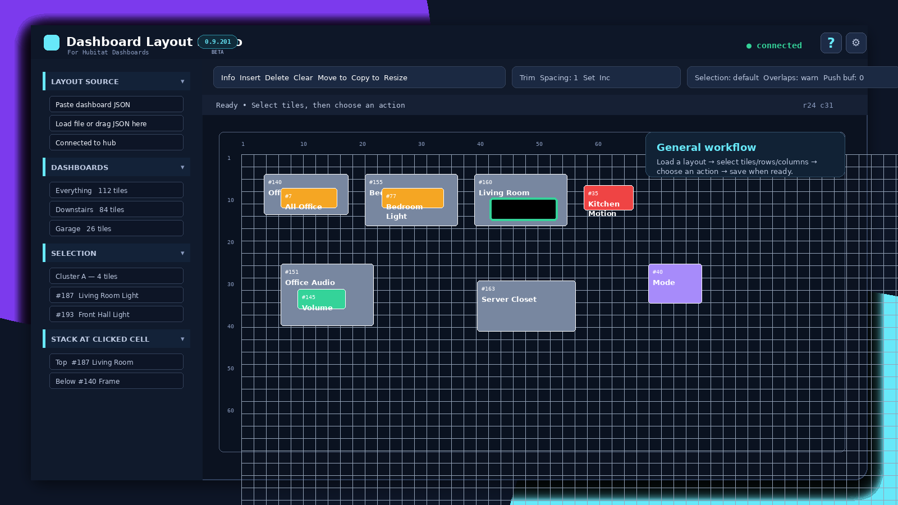
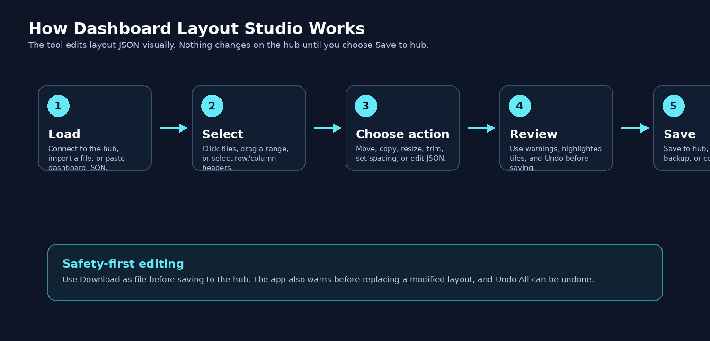
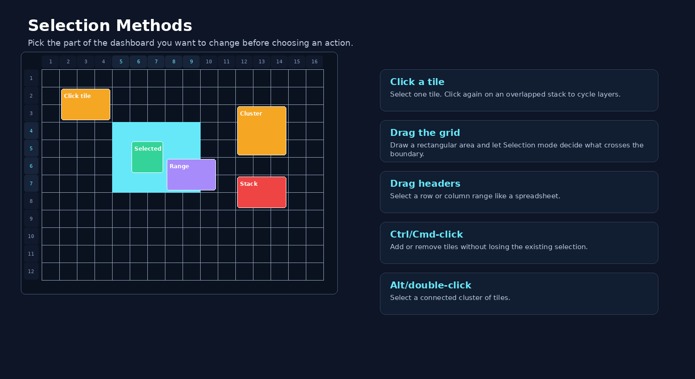
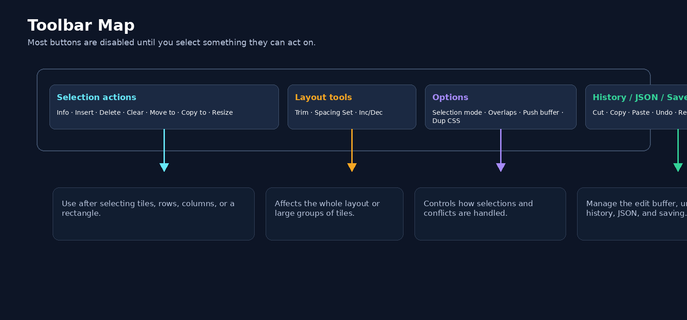
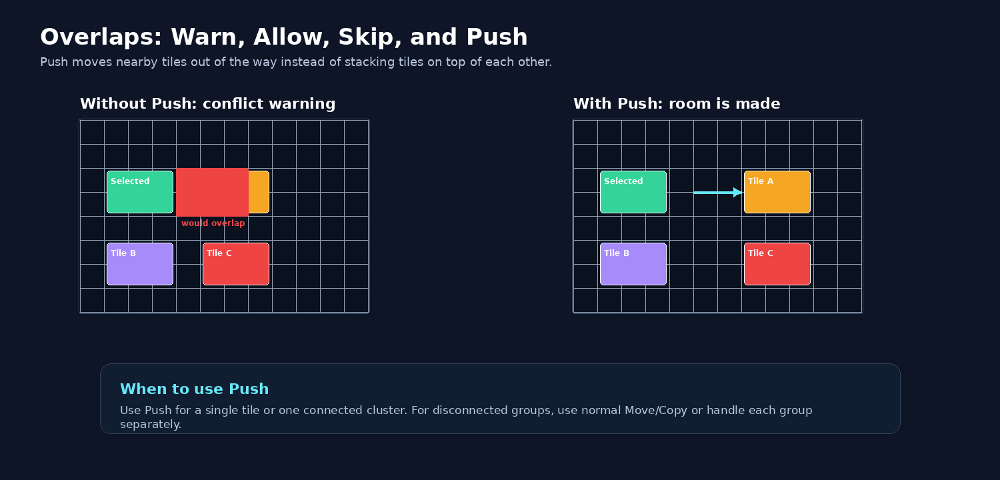
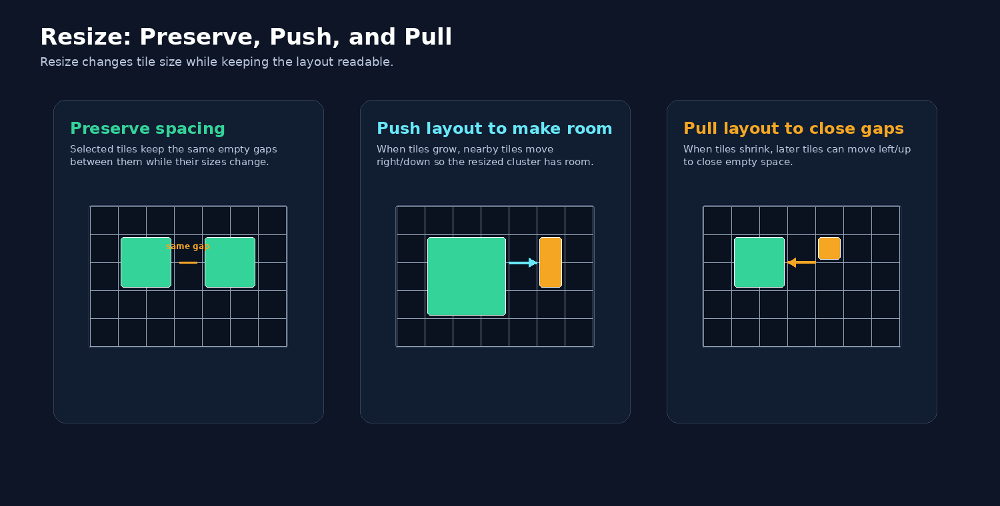
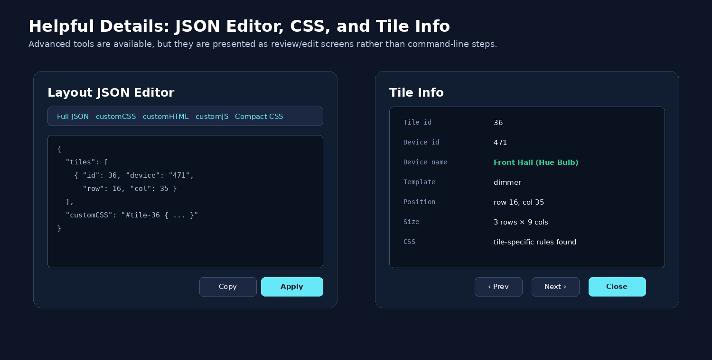

# Dashboard Layout Studio

**Dashboard Layout Studio** is a visual editor for Hubitat Dashboard v1 layout JSON. It lets you move, copy, resize, trim, space, inspect, and save dashboard tiles without manually editing row, column, `rowSpan`, and `colSpan` values.

> **Compatibility:** Dashboard Layout Studio works with **v1 layouts from the built-in Hubitat Dashboards app**. It is **not compatible with Hubitat EZ Dashboards**.



## What it is for

Use Dashboard Layout Studio when you want to:

- Rearrange tiles on a Hubitat dashboard.
- Move or copy groups of tiles without rebuilding a dashboard by hand.
- Insert or delete rows and columns in a spreadsheet-like way.
- Resize selected tiles while preserving spacing.
- Push nearby tiles out of the way instead of creating overlaps.
- Clean up spacing and unstack overlapping tiles.
- Review tile information, custom CSS, and raw JSON before saving.
- Save back to the hub or download/copy edited JSON for backup.

## Quick start

### Option 1: Use with a Hubitat hub

1. Download the latest `dashboard-layout-studio-v###.html` file.
2. In Hubitat, open **Settings → File Manager**.
3. Upload the HTML file to the hub.
4. Open it from the hub, for example:

   ```text
   http://<hub-ip>/local/dashboard-layout-studio-v201.html
   ```

5. Click **Connect To Hub**.
6. Select a discovered v1 dashboard.
7. Edit the layout.
8. Use **Save → Save to hub** when you are ready.

### Option 2: Work offline

You can also use the tool without a live hub connection:

- Click **Paste dashboard JSON** to paste a layout.
- Click **Load file** to open a `.json` file.
- Drag a dashboard JSON file onto the load area.

Offline layouts can be downloaded or copied to the clipboard, but they cannot be saved directly to the hub unless the layout was originally loaded from the hub.

## Basic workflow



1. **Load** a dashboard from the hub, a file, or pasted JSON.
2. **Select** tiles, rows, columns, or a rectangular area.
3. **Choose an action** from the toolbar.
4. **Review** warnings, highlights, and results.
5. **Save** to the hub, download a file, or copy JSON.

## Main features

### Spreadsheet-style selection

- Click a tile to select it.
- Drag on the grid to select a rectangular area.
- Drag row or column headers to select a range.
- Use Ctrl/Cmd-click to add or remove tiles from the selection.
- Use Alt-click or double-click to select a connected cluster.



### Toolbar actions

The toolbar is organized around the way people normally edit a layout:

- **Selection actions:** Info, Insert, Delete, Clear, Move to, Copy to, Resize.
- **Layout tools:** Trim and Spacing.
- **Options:** Selection mode, Overlaps behavior, Push buffer, Duplicate CSS.
- **History and output:** Cut, Copy, Paste, Undo, Redo, JSON, Save.



### Move, copy, paste, and push

Use **Move to**, **Copy to**, or **Paste** to place tiles at a new destination. If the placement would overlap another tile, the **Overlaps** setting controls what happens:

- **warn** — stop and show the conflict.
- **allow** — allow overlaps.
- **skip** — skip conflicting tiles when possible.
- **push** — move nearby tiles to make room.



### Resize selected tiles

The **Resize** dialog can change selected tiles to an exact height and width. It can also:

- Preserve spacing between resized tiles.
- Push surrounding tiles when tiles grow.
- Pull the layout closed when tiles shrink.



### Tile information and device names

When connected to the hub, Dashboard Layout Studio can use the hub device list to show friendly device names. The Tile Info dialog shows tile id, device id, device name, template, position, size, and tile-related CSS. Offline layouts continue to work, with hub-only details shown as `N/A`.

### JSON and CSS tools

The built-in JSON editor lets you review or edit:

- Full layout JSON.
- `customCSS`.
- `customHTML`.
- `customJS`.

It also supports Validate / Format, Compact CSS, Copy, Download, Restore JSON, and Apply changes.



## Important saving behavior

Dashboard Layout Studio does not change your hub dashboard until you choose **Save to hub**.

Recommended safe workflow:

1. Load from the hub.
2. Make edits.
3. Use **Save → Download as file** to keep a backup.
4. Use **Save → Save to hub** when you are ready.
5. Refresh the Hubitat dashboard page to confirm the result.

## Keyboard and mouse shortcuts

| Shortcut | Action |
|---|---|
| Ctrl/Cmd + Z | Undo |
| Ctrl/Cmd + Shift + Z | Redo |
| Ctrl/Cmd + Y | Redo |
| Ctrl/Cmd + A | Select all tiles when not typing in an editor |
| Ctrl/Cmd + C | Copy selected tiles to the internal buffer |
| Ctrl/Cmd + X | Cut selected tiles to the internal buffer |
| Ctrl/Cmd + V | Begin paste from the internal buffer |
| Ctrl/Cmd + Shift + V | Begin paste with push when eligible |
| Delete / Backspace | Clear selected tiles without shifting |
| Shift + Delete | Delete selected rows or columns and shift the layout |
| Shift held | Temporarily use push mode when eligible |
| Esc | Cancel pending placement or active resize |

## Notes and limitations

- Only Hubitat Dashboard v1 layout JSON is supported.
- Hub connection requires the HTML file to be hosted by the hub. Browser security rules can block hub access when the file is opened directly from disk or from another web server.
- Save to hub is available only for layouts loaded from the hub.
- Offline file/paste editing still works without a hub connection.
- The editor focuses on layout JSON. It is not a replacement for Hubitat’s live dashboard runtime.

## License

See the project license file for details.
